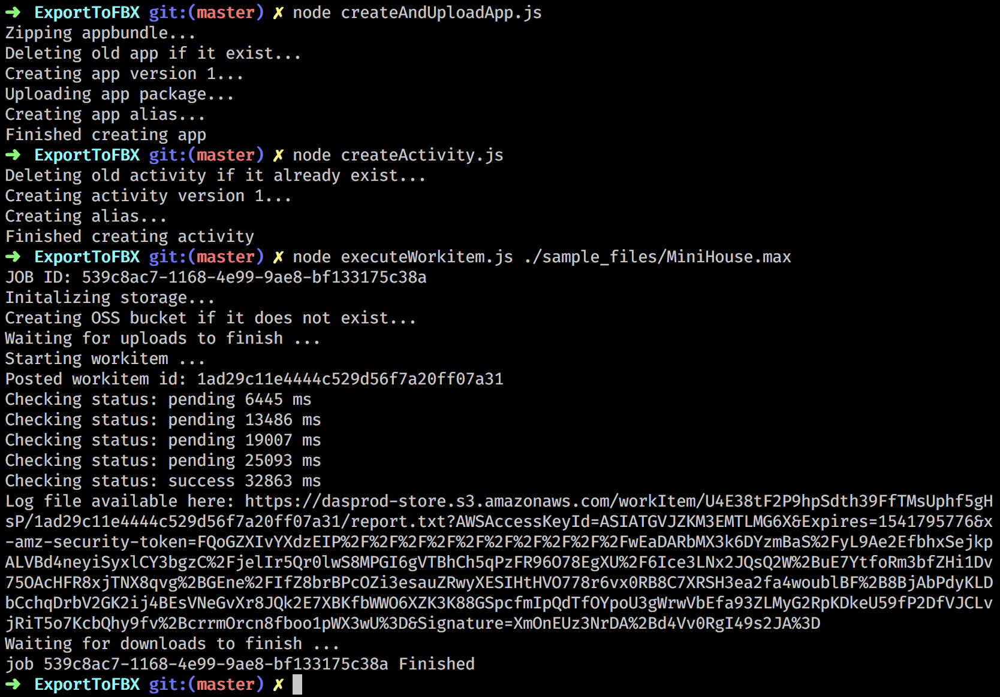

# Design Automation for 3ds Max sample


[](https://nodejs.org/)
[](http://opensource.org/licenses/MIT)
	
[](http://developer.autodesk.com/)
[](http://developer.autodesk.com/)
[](https://forge.autodesk.com/api/design-automation-cover-page/)


This sample contains 3 scripts that demonstrate how Design Automation can be leverage to convert a simple 3ds Max file into an FBX file using nodejs. Using this sample, you should be able to:

- Create and upload an appbundle
- Create an activity
- Upload to OSS your local max file
- Send a workitem to execute your activity
- Download the result FBX file from OSS to your local machine


## Sample Output



# Setup

## Prerequisites
* Node.js 10 or later

## Running locally

1. Register for a Forge application at https://forge.autodesk.com/myapps/create#. You'll need the key and secret for building and running any sample apps
    * Choose *Design Automation API* and *UDP API* for the APIs you want to use in your app.
### Setup Config file
Inside the /config folder you will need to create a file named ```dev.default.json```.

2. Inside this file you will need to provide the following information:

	```javascript
	{
	    "forge": {
	        "clientId": "Setup your forge client id here",
	        "clientSecret": "Setup your forge client secret here",
	        "nickname": "Setup your forge client id here, unless you have a nickname",
	        "ossBucketName": "Choose a unique OSS bucket name where the inputs and output will be uploaded must be of the form [-_.a-z0-9]{3,128} "
	    }
	}
```
 
3. Open a command prompt inside the javascript/ExportToFBX
and follow the steps: 

- Install the npm packages by running: 
	
	```
	npm install
	```
 
- Create your appBundle by running:
	
	```
	node createAndUploadApp.js
	```

- Create your activity by running:
	
	```
	node createActivity.js
	```

- Launch a workitem to convert your 3dsMax file to FBX:
	
	```
	node executeWorkitem.js C:/path/to/your/max/file.max
	```

# Understanding the sample
A detailed description of the sample is available in [Docs/DeveloperNotes.md](Docs/DeveloperNotes.md).


## Quotas and Limits
Apps, Activities and WorkItems have quotas and limits. To find out more information on this can be found in [Rate Limits and Quotas](https://forge.autodesk.com/en/docs/design-automation/v3/developers_guide/quotas/).

## License

This sample is licensed under the terms of the [MIT License](http://opensource.org/licenses/MIT). Please see the [LICENSE](LICENSE) file for full details.

## Written by

Jeremy Farand-Belanger, [Autodesk Inc.](http://autodesk.com)